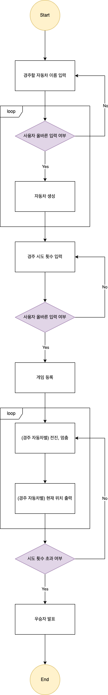

# 자동차 경주 게임
## 진행 방법
* 자동차 경주 게임 요구사항을 파악한다.
* 요구사항에 대한 구현을 완료한 후 자신의 github 아이디에 해당하는 브랜치에 Pull Request(이하 PR)를 통해 과제를 제출한다.

## 과제 제출 과정
* [과제 제출 방법](https://github.com/next-step/nextstep-docs/tree/master/precourse)

## 기능 목록
* 애플리케이션 유틸(AppUtils)
  * 경주할 자동차 입력
  * 경주 시도할 횟수 입력
* 유효성 검사 유틸(ValidateUtils)
* 자동차(RacingCar)
  * 생성
    * 이름 등록
    * 위치 초기화
  * 진행(process)
    * 전진 또는 멈춤
  * 현재 위치 출력(report)
* 자동차 경주 주최자(RacingGameHost) 
  * 생성
    * 자동차 목록 등록
    * 경주 시도 횟수 등록
  * 경기 진행(play)
  * 경기 종료 확인(isOver)
  * 우승자 발표(announceTheWinner)
* 자동차 경주 게임(RacingCarGame)
  * 게임 시작
  * 게임 진행
  * 게임 종료

